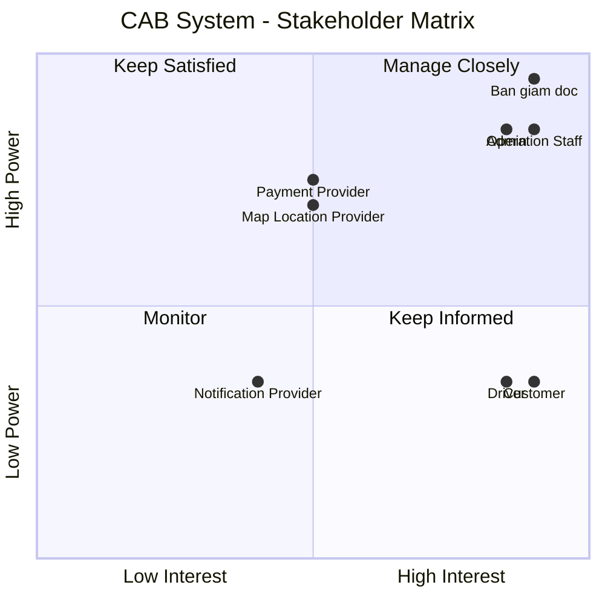

**Dự án xây dựng hệ thống CAB System – Nền tảng đặt xe**

## 1. Vấn đề hiện tại

Hệ thống đặt xe hiện tại của công ty ABC còn tồn tại nhiều hạn chế:

- Việc đặt xe chủ yếu thông qua tổng đài hoặc ứng dụng đơn giản, chưa mang lại trải nghiệm thuận tiện cho khách hàng.
- Việc phân công tài xế chủ yếu được thực hiện thủ công, dẫn đến xử lý chậm và khó mở rộng.
- Khách hàng khó theo dõi trạng thái yêu cầu đặt xe và trạng thái chuyến đi.
- Khách hàng không thể dễ dàng biết tài xế nào đã nhận chuyến và thời gian dự kiến tài xế đến.
- Khi tài xế từ chối hoặc không phản hồi, hệ thống chưa có cơ chế tự động tìm tài xế khác hiệu quả.
- Thông tin thanh toán chưa được quản lý tập trung.
- Khách hàng khó tra cứu lịch sử chuyến đi và thông tin giao dịch.
- Bộ phận vận hành gặp khó khăn trong việc quản lý khách hàng, tài xế, phương tiện và các chuyến đi.
- Hệ thống hiện tại khó mở rộng khi số lượng khách hàng và tài xế tăng lên.
- Việc bổ sung tính năng hoặc tích hợp các dịch vụ mới có thể ảnh hưởng đến các chức năng đang hoạt động.

## 2. Stakeholders

| # | Stakeholder | Vai trò |
|---|---|---|
| 1 | **Ban giám đốc** | Chủ dự án, ra quyết định và định hướng kinh doanh |
| 2 | **Khách hàng (Customer)** | Người sử dụng dịch vụ đặt xe |
| 3 | **Tài xế (Driver)** | Người cung cấp dịch vụ vận chuyển |
| 4 | **Nhân viên vận hành (Operation Staff)** | Quản lý và hỗ trợ hoạt động đặt xe |
| 5 | **Admin** | Quản trị hệ thống và phân quyền |
| 6 | **Payment Provider** | Cung cấp dịch vụ thanh toán điện tử |
| 7 | **Notification Provider** | Cung cấp dịch vụ gửi thông báo |
| 8 | **Map / Location Provider** | Cung cấp dịch vụ bản đồ, định vị và ETA |

##  Stakeholder Matrix

| Stakeholder | Power | Interest | Strategy |
|---|---|---|---|
| **Ban giám đốc** | Cao | Cao | **Manage Closely** – Thường xuyên cập nhật tiến độ, rủi ro và các quyết định quan trọng |
| **Khách hàng** | Thấp | Cao | **Keep Informed** – Thu thập feedback và cập nhật các thay đổi ảnh hưởng đến trải nghiệm |
| **Tài xế** | Thấp | Cao | **Keep Informed** – Thu thập nhu cầu, feedback và đảm bảo quy trình nhận/thực hiện chuyến phù hợp |
| **Nhân viên vận hành** | Cao | Cao | **Manage Closely** – Tham gia phân tích nghiệp vụ, kiểm thử và xác nhận quy trình |
| **Admin** | Cao | Cao | **Manage Closely** – Tham gia xác định yêu cầu quản trị, bảo mật và phân quyền |
| **Payment Provider** | Cao | Trung bình | **Keep Satisfied** – Đảm bảo tích hợp, giao dịch và xử lý lỗi hoạt động ổn định |
| **Notification Provider** | Trung bình | Trung bình | **Monitor** – Theo dõi khả năng tích hợp và trạng thái dịch vụ |
| **Map/Location Provider** | Cao | Trung bình | **Keep Satisfied** – Đảm bảo dữ liệu vị trí, khoảng cách và ETA hoạt động ổn định |

##  3. Mục đích nghiệp vụ

| ID | Mục đích nghiệp vụ | Mô tả |
|---|---|---|
| BO-01 | **Cải thiện trải nghiệm khách hàng** | Giúp khách hàng đặt xe nhanh chóng, dễ dàng theo dõi chuyến đi và quản lý thông tin thanh toán. |
| BO-02 | **Tự động hóa quy trình đặt xe** | Giảm sự phụ thuộc vào thao tác thủ công trong việc tiếp nhận yêu cầu và phân công tài xế. |
| BO-03 | **Nâng cao hiệu quả phân công tài xế** | Tự động tìm và ưu tiên tài xế phù hợp, gần khách hàng và sẵn sàng nhận chuyến. |
| BO-04 | **Nâng cao hiệu quả vận hành** | Cung cấp công cụ giúp nhân viên vận hành theo dõi, quản lý và xử lý các chuyến đi hiệu quả hơn. |
| BO-05 | **Quản lý tập trung dữ liệu** | Tập trung quản lý thông tin khách hàng, tài xế, phương tiện, chuyến đi và giao dịch. |
| BO-06 | **Tăng tính minh bạch trong thanh toán** | Quản lý tập trung thông tin cước và kết quả thanh toán, đồng thời hỗ trợ nhiều phương thức thanh toán. |
| BO-07 | **Nâng cao khả năng giám sát và ra quyết định** | Cung cấp báo cáo về số lượng chuyến, doanh thu, tỷ lệ hoàn thành, tỷ lệ hủy và hiệu quả tài xế. |
| BO-08 | **Đảm bảo khả năng mở rộng** | Xây dựng nền tảng có thể phục vụ số lượng lớn khách hàng và tài xế khi doanh nghiệp phát triển. |
| BO-09 | **Tăng khả năng mở rộng tính năng** | Cho phép bổ sung dịch vụ, phương thức thanh toán, kênh thông báo và các tính năng mới trong tương lai. |
| BO-10 | **Nâng cao độ ổn định và bảo mật** | Đảm bảo hệ thống hoạt động ổn định, bảo vệ dữ liệu và hạn chế ảnh hưởng khi một thành phần gặp sự cố. |

## 4. Kế hoạch triển khai 7 tuần

### Tuần 1 - Phân tích và xác định yêu cầu

- Xác định vấn đề hiện tại.
- Xác định phạm vi dự án.
- Xác định các bên liên quan.
- Xác định người sử dụng hệ thống.
- Xác định mục đích nghiệp vụ.
- Xác định yêu cầu nghiệp vụ.
- Phân tích quy trình nghiệp vụ.
- Xác định các vấn đề chưa rõ cần xác nhận.
- Xác định phạm vi phiên bản đầu tiên.

**Kết quả:**
- Tài liệu phạm vi dự án.
- Danh sách các bên liên quan.
- Ma trận các bên liên quan.
- Danh sách người sử dụng hệ thống.
- Mục đích nghiệp vụ.
- Yêu cầu nghiệp vụ.
- Quy trình nghiệp vụ.
- Danh sách vấn đề cần xác nhận.

### Tuần 2 - Quản lý người dùng

- Đăng ký tài khoản.
- Đăng nhập.
- Xác thực người dùng.
- Phân quyền người dùng.
- Quản lý thông tin khách hàng.
- Quản lý thông tin tài xế.
- Quản lý phương tiện.

**Kết quả:**
- Hoàn thành chức năng quản lý khách hàng.
- Hoàn thành chức năng quản lý tài xế.
- Hoàn thành chức năng quản lý phương tiện.
- Hoàn thành xác thực và phân quyền.

### Tuần 3 - Đặt xe và phân công tài xế

- Tạo yêu cầu đặt xe.
- Nhập điểm đón và điểm đến.
- Lựa chọn loại xe.
- Tìm kiếm tài xế phù hợp.
- Ưu tiên tài xế gần khách hàng.
- Gửi yêu cầu đến tài xế.
- Tài xế chấp nhận hoặc từ chối chuyến.
- Xử lý khi tài xế không phản hồi.
- Tự động tìm tài xế tiếp theo.
- Xử lý trường hợp không tìm được tài xế.

**Kết quả:**
- Hoàn thành quy trình đặt xe.
- Hoàn thành chức năng tìm tài xế.
- Hoàn thành chức năng phân công tài xế.

### Tuần 4 - Theo dõi chuyến đi và thông báo

- Cập nhật vị trí tài xế.
- Theo dõi trạng thái chuyến đi.
- Tài xế đến điểm đón.
- Tài xế đã đón khách.
- Chuyến đi đang thực hiện.
- Hoàn thành chuyến đi.
- Gửi thông báo cho khách hàng.
- Gửi thông báo cho tài xế.

**Kết quả:**
- Hoàn thành chức năng theo dõi chuyến đi.
- Hoàn thành cập nhật vị trí.
- Hoàn thành hệ thống thông báo.

### Tuần 5 - Tính cước và thanh toán

- Xác định số tiền phải trả.
- Tính cước chuyến đi.
- Thanh toán bằng tiền mặt.
- Thanh toán điện tử.
- Tích hợp nhà cung cấp thanh toán.
- Xử lý thanh toán thành công.
- Xử lý thanh toán thất bại.
- Xử lý thanh toán lại.
- Lưu lịch sử giao dịch.

**Kết quả:**
- Hoàn thành chức năng tính cước.
- Hoàn thành chức năng thanh toán.
- Hoàn thành xử lý các trường hợp thanh toán thất bại.

### Tuần 6 - Vận hành, báo cáo và bảo mật

- Quản lý khách hàng.
- Quản lý tài xế.
- Quản lý phương tiện.
- Theo dõi các chuyến đang diễn ra.
- Xử lý các chuyến bị lỗi.
- Tra cứu lịch sử giao dịch.
- Phân quyền nhân viên.
- Quản lý quyền truy cập.
- Lưu vết các thao tác quan trọng.
- Báo cáo số lượng chuyến.
- Báo cáo doanh thu.
- Báo cáo tỷ lệ hoàn thành.
- Báo cáo tỷ lệ hủy.
- Báo cáo hiệu quả tài xế.

**Kết quả:**
- Hoàn thành giao diện vận hành.
- Hoàn thành báo cáo.
- Hoàn thành phân quyền.
- Hoàn thành lưu vết thao tác.

### Tuần 7 - Kiểm thử và triển khai

- Kiểm thử các chức năng.
- Kiểm thử tích hợp.
- Kiểm thử toàn bộ quy trình đặt xe.
- Kiểm thử thanh toán.
- Kiểm thử thông báo.
- Kiểm thử hiệu năng.
- Kiểm thử bảo mật.
- Kiểm thử nghiệm thu với khách hàng.
- Sửa lỗi.
- Triển khai hệ thống.
- Hoàn thiện tài liệu.

**Kết quả:**
- Hoàn thành kiểm thử.
- Hoàn thành sửa lỗi.
- Hệ thống được triển khai.
- Hoàn thành tài liệu bàn giao.

## . System Users

| # | User | Mục đích sử dụng |
|---|---|---|
| 1 | **Customer** | Đặt xe, theo dõi chuyến, thanh toán và đánh giá tài xế |
| 2 | **Driver** | Nhận chuyến, thực hiện chuyến và cập nhật vị trí/trạng thái |
| 3 | **Operation Staff** | Theo dõi và quản lý hoạt động đặt xe, xử lý sự cố |
| 4 | **Admin** | Quản trị hệ thống, phân quyền và theo dõi audit log |

## . Yêu cầu nghiệp vụ (Business Requirements)

| ID     | Yêu cầu nghiệp vụ | Mô tả |
|--------|---|---|
| BR-01 | **Đặt xe trực tuyến** | Cho phép khách hàng đặt xe trực tuyến một cách nhanh chóng và thuận tiện. |
| BR-02 | **Tự động tìm và phân công tài xế** | Tự động tìm tài xế phù hợp dựa trên vị trí, trạng thái sẵn sàng và các tiêu chí vận hành. |
| BR-03 | **Theo dõi chuyến đi** | Cho phép khách hàng theo dõi trạng thái chuyến đi, thông tin tài xế và thời gian dự kiến tài xế đến. |
| BR-04 | **Quản lý chuyến đi** | Quản lý toàn bộ vòng đời chuyến đi từ khi tạo yêu cầu đến khi hoàn thành hoặc hủy chuyến. |
| BR-05 | **Tính cước** | Xác định số tiền khách hàng phải trả dựa trên thông tin chuyến đi và chính sách tính cước của doanh nghiệp. |
| BR-06 | **Quản lý thanh toán** | Hỗ trợ thanh toán tiền mặt và thanh toán điện tử thông qua nhà cung cấp thanh toán bên ngoài. |
| BR-07 | **Quản lý thông báo** | Gửi thông báo cho khách hàng và tài xế về các sự kiện quan trọng trong quá trình đặt và thực hiện chuyến đi. |
| BR-08 | **Quản lý tài xế và phương tiện** | Cho phép quản lý thông tin tài xế, phương tiện, trạng thái hoạt động và vị trí của tài xế. |
| BR-09 | **Quản lý vận hành** | Cung cấp công cụ để nhân viên vận hành quản lý khách hàng, tài xế, phương tiện, chuyến đi và giao dịch. |
| BR-10 | **Báo cáo và thống kê** | Cung cấp báo cáo về số lượng chuyến, doanh thu, tỷ lệ hoàn thành, tỷ lệ hủy và hiệu quả hoạt động của tài xế. |
| BR-11 | **Bảo mật và kiểm soát truy cập** | Bảo vệ thông tin cá nhân, dữ liệu vị trí, dữ liệu giao dịch và kiểm soát quyền truy cập của người dùng. |
| BR-12 | **Khả năng mở rộng và ổn định** | Đảm bảo hệ thống có thể phục vụ số lượng lớn người dùng và hạn chế ảnh hưởng khi một thành phần gặp sự cố. |
| BR-13 | **Khả năng mở rộng tính năng** | Cho phép bổ sung loại dịch vụ, phương thức thanh toán, kênh thông báo và các tính năng mới trong tương lai. |

