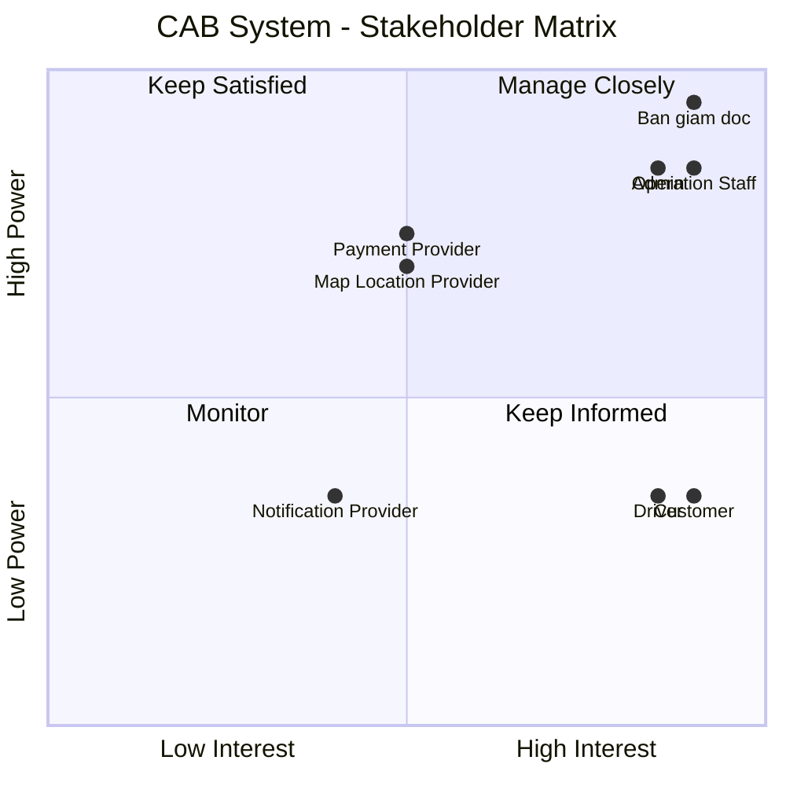

## 1. Vấn đề hiện tại

Hệ thống đặt xe hiện tại của công ty ABC còn tồn tại nhiều hạn chế:

- Việc đặt xe chủ yếu thông qua tổng đài hoặc ứng dụng đơn giản, chưa mang lại trải nghiệm thuận tiện cho khách hàng.
- Việc phân công tài xế chủ yếu được thực hiện thủ công, dẫn đến xử lý chậm và khó mở rộng.
- Khách hàng khó theo dõi trạng thái yêu cầu đặt xe và trạng thái chuyến đi.
- Khách hàng không thể dễ dàng biết tài xế nào đã nhận chuyến và thời gian dự kiến tài xế đến.
- Khi tài xế từ chối hoặc không phản hồi, hệ thống chưa có cơ chế tự động tìm tài xế khác hiệu quả.
- Thông tin thanh toán chưa được quản lý tập trung.
- Khách hàng khó tra cứu lịch sử chuyến đi và thông tin giao dịch.
- Bộ phận vận hành gặp khó khăn trong việc quản lý khách hàng, tài xế, phương tiện và các chuyến đi.
- Hệ thống hiện tại khó mở rộng khi số lượng khách hàng và tài xế tăng lên.
- Việc bổ sung tính năng hoặc tích hợp các dịch vụ mới có thể ảnh hưởng đến các chức năng đang hoạt động.

Mục tiêu: Xây dựng nền tảng đặt xe có khả năng phục vụ số lượng lớn khách hàng và tài xế, tự động hóa việc tìm tài xế, quản lý toàn bộ vòng đời chuyến đi, thanh toán, thông báo và hỗ trợ vận hành.

## 2. Stakeholders

| # | Stakeholder | Vai trò |
|---|---|---|
| 1 | **Ban giám đốc** | Chủ dự án, ra quyết định và định hướng kinh doanh |
| 2 | **Khách hàng (Customer)** | Người sử dụng dịch vụ đặt xe |
| 3 | **Tài xế (Driver)** | Người cung cấp dịch vụ vận chuyển |
| 4 | **Nhân viên vận hành (Operation Staff)** | Quản lý và hỗ trợ hoạt động đặt xe |
| 5 | **Admin** | Quản trị hệ thống và phân quyền |
| 6 | **Payment Provider** | Cung cấp dịch vụ thanh toán điện tử |
| 7 | **Notification Provider** | Cung cấp dịch vụ gửi thông báo |
| 8 | **Map / Location Provider** | Cung cấp dịch vụ bản đồ, định vị và ETA |

## 3. Stakeholder Matrix

| Stakeholder | Power | Interest | Strategy |
|---|---|---|---|
| **Ban giám đốc** | Cao | Cao | **Manage Closely** – Thường xuyên cập nhật tiến độ, rủi ro và các quyết định quan trọng |
| **Khách hàng** | Thấp | Cao | **Keep Informed** – Thu thập feedback và cập nhật các thay đổi ảnh hưởng đến trải nghiệm |
| **Tài xế** | Thấp | Cao | **Keep Informed** – Thu thập nhu cầu, feedback và đảm bảo quy trình nhận/thực hiện chuyến phù hợp |
| **Nhân viên vận hành** | Cao | Cao | **Manage Closely** – Tham gia phân tích nghiệp vụ, kiểm thử và xác nhận quy trình |
| **Admin** | Cao | Cao | **Manage Closely** – Tham gia xác định yêu cầu quản trị, bảo mật và phân quyền |
| **Payment Provider** | Cao | Trung bình | **Keep Satisfied** – Đảm bảo tích hợp, giao dịch và xử lý lỗi hoạt động ổn định |
| **Notification Provider** | Trung bình | Trung bình | **Monitor** – Theo dõi khả năng tích hợp và trạng thái dịch vụ |
| **Map/Location Provider** | Cao | Trung bình | **Keep Satisfied** – Đảm bảo dữ liệu vị trí, khoảng cách và ETA hoạt động ổn định |

## 4. Stakeholder Matrix

