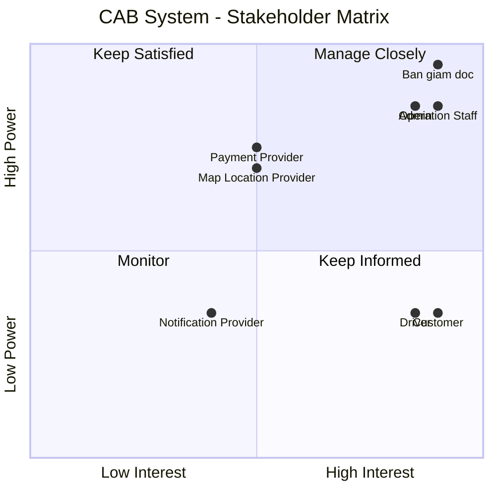

**Dự án xây dựng hệ thống CAB System – Nền tảng đặt xe**

## 1. Vấn đề hiện tại

Hệ thống đặt xe hiện tại của công ty ABC còn tồn tại nhiều hạn chế:

- Việc đặt xe chủ yếu thông qua tổng đài hoặc ứng dụng đơn giản, chưa mang lại trải nghiệm thuận tiện cho khách hàng.
- Việc phân công tài xế chủ yếu được thực hiện thủ công, dẫn đến xử lý chậm và khó mở rộng.
- Khách hàng khó theo dõi trạng thái yêu cầu đặt xe và trạng thái chuyến đi.
- Khách hàng không thể dễ dàng biết tài xế nào đã nhận chuyến và thời gian dự kiến tài xế đến.
- Khi tài xế từ chối hoặc không phản hồi, hệ thống chưa có cơ chế tự động tìm tài xế khác hiệu quả.
- Thông tin thanh toán chưa được quản lý tập trung.
- Khách hàng khó tra cứu lịch sử chuyến đi và thông tin giao dịch.
- Bộ phận vận hành gặp khó khăn trong việc quản lý khách hàng, tài xế, phương tiện và các chuyến đi.
- Hệ thống hiện tại khó mở rộng khi số lượng khách hàng và tài xế tăng lên.
- Việc bổ sung tính năng hoặc tích hợp các dịch vụ mới có thể ảnh hưởng đến các chức năng đang hoạt động.

## 2. Stakeholders

| # | Stakeholder | Vai trò |
|---|---|---|
| 1 | **Ban giám đốc** | Chủ dự án, ra quyết định và định hướng kinh doanh |
| 2 | **Khách hàng (Customer)** | Người sử dụng dịch vụ đặt xe |
| 3 | **Tài xế (Driver)** | Người cung cấp dịch vụ vận chuyển |
| 4 | **Nhân viên vận hành (Operation Staff)** | Quản lý và hỗ trợ hoạt động đặt xe |
| 5 | **Admin** | Quản trị hệ thống và phân quyền |
| 6 | **Payment Provider** | Cung cấp dịch vụ thanh toán điện tử |
| 7 | **Notification Provider** | Cung cấp dịch vụ gửi thông báo |
| 8 | **Map / Location Provider** | Cung cấp dịch vụ bản đồ, định vị và ETA |

##  Stakeholder Matrix

| Stakeholder | Power | Interest | Strategy |
|---|---|---|---|
| **Ban giám đốc** | Cao | Cao | **Manage Closely** – Thường xuyên cập nhật tiến độ, rủi ro và các quyết định quan trọng |
| **Khách hàng** | Thấp | Cao | **Keep Informed** – Thu thập feedback và cập nhật các thay đổi ảnh hưởng đến trải nghiệm |
| **Tài xế** | Thấp | Cao | **Keep Informed** – Thu thập nhu cầu, feedback và đảm bảo quy trình nhận/thực hiện chuyến phù hợp |
| **Nhân viên vận hành** | Cao | Cao | **Manage Closely** – Tham gia phân tích nghiệp vụ, kiểm thử và xác nhận quy trình |
| **Admin** | Cao | Cao | **Manage Closely** – Tham gia xác định yêu cầu quản trị, bảo mật và phân quyền |
| **Payment Provider** | Cao | Trung bình | **Keep Satisfied** – Đảm bảo tích hợp, giao dịch và xử lý lỗi hoạt động ổn định |
| **Notification Provider** | Trung bình | Trung bình | **Monitor** – Theo dõi khả năng tích hợp và trạng thái dịch vụ |
| **Map/Location Provider** | Cao | Trung bình | **Keep Satisfied** – Đảm bảo dữ liệu vị trí, khoảng cách và ETA hoạt động ổn định |

##  3. Mục đích nghiệp vụ

| ID | Mục đích nghiệp vụ | Mô tả |
|---|---|---|
| BO-01 | **Cải thiện trải nghiệm khách hàng** | Giúp khách hàng đặt xe nhanh chóng, dễ dàng theo dõi chuyến đi và quản lý thông tin thanh toán. |
| BO-02 | **Tự động hóa quy trình đặt xe** | Giảm sự phụ thuộc vào thao tác thủ công trong việc tiếp nhận yêu cầu và phân công tài xế. |
| BO-03 | **Nâng cao hiệu quả phân công tài xế** | Tự động tìm và ưu tiên tài xế phù hợp, gần khách hàng và sẵn sàng nhận chuyến. |
| BO-04 | **Nâng cao hiệu quả vận hành** | Cung cấp công cụ giúp nhân viên vận hành theo dõi, quản lý và xử lý các chuyến đi hiệu quả hơn. |
| BO-05 | **Quản lý tập trung dữ liệu** | Tập trung quản lý thông tin khách hàng, tài xế, phương tiện, chuyến đi và giao dịch. |
| BO-06 | **Tăng tính minh bạch trong thanh toán** | Quản lý tập trung thông tin cước và kết quả thanh toán, đồng thời hỗ trợ nhiều phương thức thanh toán. |
| BO-07 | **Nâng cao khả năng giám sát và ra quyết định** | Cung cấp báo cáo về số lượng chuyến, doanh thu, tỷ lệ hoàn thành, tỷ lệ hủy và hiệu quả tài xế. |
| BO-08 | **Đảm bảo khả năng mở rộng** | Xây dựng nền tảng có thể phục vụ số lượng lớn khách hàng và tài xế khi doanh nghiệp phát triển. |
| BO-09 | **Tăng khả năng mở rộng tính năng** | Cho phép bổ sung dịch vụ, phương thức thanh toán, kênh thông báo và các tính năng mới trong tương lai. |
| BO-10 | **Nâng cao độ ổn định và bảo mật** | Đảm bảo hệ thống hoạt động ổn định, bảo vệ dữ liệu và hạn chế ảnh hưởng khi một thành phần gặp sự cố. |

## 4. Kế hoạch triển khai 7 tuần

| Tuần | Module | Nội dung chính |
|---|---|---|
| **Tuần 1** | **M01 - Xác thực & Quản lý tài khoản** | Đăng ký, đăng nhập, xác thực, cập nhật thông tin và phân quyền |
| **Tuần 2** | **M02 - Quản lý khách hàng** + **M03 - Quản lý tài xế & phương tiện** | Hồ sơ khách hàng, tài xế, phương tiện và trạng thái hoạt động |
| **Tuần 3** | **M04 - Đặt xe** | Tạo yêu cầu, điểm đón, điểm đến, loại xe và quản lý yêu cầu đặt xe |
| **Tuần 4** | **M05 - Phân công tài xế** + **M06 - Quản lý chuyến đi & định vị** | Tìm tài xế, phân công, xử lý từ chối/timeout, trạng thái chuyến và vị trí |
| **Tuần 5** | **M07 - Tính cước & thanh toán** | Tính cước, tiền mặt, thanh toán điện tử và xử lý giao dịch thất bại |
| **Tuần 6** | **M08 - Thông báo** + **M09 - Vận hành & quản trị** + **M10 - Báo cáo & kiểm toán** | Thông báo, quản lý vận hành, báo cáo, phân quyền và audit log |
| **Tuần 7** | **Tích hợp & hoàn thiện** | Kiểm thử tích hợp, kiểm thử nghiệm thu, sửa lỗi, kiểm thử hiệu năng, triển khai và bàn giao |

## 5. Yêu cầu nghiệp vụ (Business Requirements)

| ID     | Yêu cầu nghiệp vụ | Mô tả |
|--------|---|---|
| BR-01 | **Đặt xe trực tuyến** | Cho phép khách hàng đặt xe trực tuyến, chọn điểm đi, điểm đến một cách nhanh chóng và thuận tiện. |
| BR-02 | **Tự động tìm và phân công tài xế** | Tự động tìm tài xế phù hợp dựa trên vị trí, trạng thái sẵn sàng và các tiêu chí vận hành. |
| BR-03 | **Theo dõi chuyến đi** | Cho phép khách hàng theo dõi trạng thái chuyến đi, thông tin tài xế và thời gian dự kiến tài xế đến. |
| BR-04 | **Đánh giá chuyến đi** | Cho phép khách hàng đánh giá tài xế sau khi chuyến đi hoàn thành và ghi nhận phản hồi để doanh nghiệp theo dõi chất lượng dịch vụ. |
| BR-05 | **Tính cước** | Xác định số tiền khách hàng phải trả dựa trên thông tin chuyến đi và chính sách tính cước của doanh nghiệp. |
| BR-06 | **Quản lý thanh toán** | Hỗ trợ thanh toán tiền mặt và thanh toán điện tử thông qua nhà cung cấp thanh toán bên ngoài. |
| BR-07 | **Quản lý thông báo** | Gửi thông báo cho khách hàng và tài xế về các sự kiện quan trọng trong quá trình đặt và thực hiện chuyến đi. |
| BR-08 | **Quản lý tài xế và phương tiện** | Cho phép quản lý thông tin tài xế, phương tiện, trạng thái hoạt động và vị trí của tài xế. |
| BR-09 | **Quản lý vận hành** | Cung cấp công cụ để nhân viên vận hành quản lý khách hàng, tài xế, phương tiện, chuyến đi và giao dịch. |
| BR-10 | **Báo cáo và thống kê** | Cung cấp báo cáo về số lượng chuyến, doanh thu, tỷ lệ hoàn thành, tỷ lệ hủy và hiệu quả hoạt động của tài xế. |
| BR-11 | **Bảo mật và kiểm soát truy cập** | Bảo vệ thông tin cá nhân, dữ liệu vị trí, dữ liệu giao dịch và kiểm soát quyền truy cập của người dùng. |
| BR-12 | **Khả năng mở rộng và ổn định** | Đảm bảo hệ thống có thể phục vụ số lượng lớn người dùng và hạn chế ảnh hưởng khi một thành phần gặp sự cố. |
| BR-13 | **Khả năng mở rộng tính năng** | Cho phép bổ sung loại dịch vụ, phương thức thanh toán, kênh thông báo và các tính năng mới trong tương lai. |

##  (Functional Requirements)

### BR-01 - Đặt xe trực tuyến

| ID | Yêu cầu chức năng | Mô tả |
|---|---|---|
| <code>FR-01.1</code> | Nhập điểm đi | Cho phép khách hàng nhập hoặc chọn điểm đón. |
| <code>FR-01.2</code> | Nhập điểm đến | Cho phép khách hàng nhập hoặc chọn điểm đến. |
| <code>FR-01.3</code> | Chọn loại xe | Cho phép khách hàng lựa chọn loại xe phù hợp. |
| <code>FR-01.4</code> | Tạo yêu cầu đặt xe | Cho phép khách hàng gửi yêu cầu đặt xe với các thông tin đã cung cấp. |
| <code>FR-01.5</code> | Kiểm tra thông tin đặt xe | Hệ thống kiểm tra tính hợp lệ của thông tin trước khi tạo yêu cầu. |
| <code>FR-01.6</code> | Xem trạng thái yêu cầu | Cho phép khách hàng xem trạng thái của yêu cầu đặt xe. |
| <code>FR-01.7</code> | Hủy yêu cầu đặt xe | Cho phép khách hàng hủy yêu cầu theo chính sách của doanh nghiệp. |

### BR-02 - Tự động tìm và phân công tài xế

| ID | Yêu cầu chức năng | Mô tả |
|---|---|---|
| <code>FR-02.1</code> | Xác định tài xế phù hợp | Hệ thống xác định danh sách tài xế dựa trên vị trí, trạng thái sẵn sàng và các tiêu chí vận hành. |
| <code>FR-02.2</code> | Ưu tiên tài xế | Hệ thống ưu tiên tài xế phù hợp và gần khách hàng. |
| <code>FR-02.3</code> | Gửi yêu cầu đến tài xế | Hệ thống gửi thông tin chuyến đến tài xế được lựa chọn. |
| <code>FR-02.4</code> | Xử lý tài xế chấp nhận | Hệ thống ghi nhận tài xế nhận chuyến và cập nhật thông tin chuyến đi. |
| <code>FR-02.5</code> | Xử lý tài xế từ chối | Hệ thống tiếp tục tìm tài xế khác khi tài xế từ chối chuyến. |
| <code>FR-02.6</code> | Xử lý tài xế không phản hồi | Hệ thống xác định tài xế không phản hồi trong thời gian quy định và tiếp tục tìm tài xế khác. |
| <code>FR-02.7</code> | Xử lý không tìm được tài xế | Hệ thống thông báo cho khách hàng khi không tìm được tài xế phù hợp. |

### BR-03 - Theo dõi chuyến đi

| ID | Yêu cầu chức năng | Mô tả |
|---|---|---|
| <code>FR-03.1</code> | Xem thông tin tài xế | Cho phép khách hàng xem thông tin tài xế đã nhận chuyến. |
| <code>FR-03.2</code> | Xem thông tin phương tiện | Cho phép khách hàng xem thông tin phương tiện được sử dụng cho chuyến đi. |
| <code>FR-03.3</code> | Theo dõi vị trí tài xế | Cho phép khách hàng theo dõi vị trí hiện tại của tài xế. |
| <code>FR-03.4</code> | Xem thời gian dự kiến | Hệ thống cung cấp thời gian dự kiến tài xế đến điểm đón. |
| <code>FR-03.5</code> | Theo dõi trạng thái chuyến | Cho phép khách hàng theo dõi trạng thái hiện tại của chuyến đi. |

### BR-04 - Đánh giá chuyến đi

| ID | Yêu cầu chức năng | Mô tả |
|---|---|---|
| <code>FR-04.1</code> | Đánh giá tài xế | Cho phép khách hàng đánh giá tài xế sau khi chuyến đi hoàn thành. |
| <code>FR-04.2</code> | Gửi phản hồi | Cho phép khách hàng gửi nhận xét hoặc phản hồi về chuyến đi. |
| <code>FR-04.3</code> | Kiểm tra điều kiện đánh giá | Hệ thống chỉ cho phép khách hàng đánh giá chuyến đi đã hoàn thành. |
| <code>FR-04.4</code> | Lưu kết quả đánh giá | Hệ thống lưu thông tin đánh giá và phản hồi của khách hàng. |
| <code>FR-04.5</code> | Tra cứu đánh giá | Nhân viên có quyền có thể tra cứu đánh giá để theo dõi chất lượng dịch vụ. |

### BR-05 - Tính cước

| ID | Yêu cầu chức năng | Mô tả |
|---|---|---|
| <code>FR-05.1</code> | Xác định thông tin tính cước | Hệ thống thu thập thông tin cần thiết để tính cước chuyến đi. |
| <code>FR-05.2</code> | Áp dụng chính sách tính cước | Hệ thống áp dụng quy tắc tính cước tương ứng với loại dịch vụ và thông tin chuyến đi. |
| <code>FR-05.3</code> | Tính số tiền phải trả | Hệ thống tính toán số tiền khách hàng phải thanh toán. |
| <code>FR-05.4</code> | Hiển thị số tiền | Hệ thống hiển thị số tiền phải trả cho khách hàng. |
| <code>FR-05.5</code> | Lưu thông tin cước | Hệ thống lưu thông tin tính cước gắn với chuyến đi. |

### BR-06 - Quản lý thanh toán

| ID | Yêu cầu chức năng | Mô tả |
|---|---|---|
| <code>FR-06.1</code> | Thanh toán tiền mặt | Hệ thống cho phép ghi nhận thanh toán bằng tiền mặt. |
| <code>FR-06.2</code> | Khởi tạo thanh toán điện tử | Hệ thống gửi yêu cầu thanh toán đến nhà cung cấp thanh toán bên ngoài. |
| <code>FR-06.3</code> | Nhận kết quả thanh toán | Hệ thống tiếp nhận và ghi nhận kết quả giao dịch từ nhà cung cấp thanh toán. |
| <code>FR-06.4</code> | Xử lý thanh toán thành công | Hệ thống cập nhật trạng thái thanh toán khi giao dịch thành công. |
| <code>FR-06.5</code> | Xử lý thanh toán thất bại | Hệ thống thông báo cho khách hàng khi giao dịch thất bại. |
| <code>FR-06.6</code> | Thanh toán lại | Cho phép khách hàng thực hiện lại thanh toán theo chính sách của doanh nghiệp. |
| <code>FR-06.7</code> | Tra cứu giao dịch | Cho phép nhân viên có quyền tra cứu lịch sử giao dịch. |
| <code>FR-06.8</code> | Bảo vệ thông tin thanh toán | Hệ thống không lưu trực tiếp thông tin nhạy cảm của thẻ hoặc tài khoản thanh toán. |

### BR-07 - Quản lý thông báo

| ID | Yêu cầu chức năng | Mô tả |
|---|---|---|
| <code>FR-07.1</code> | Thông báo tiếp nhận yêu cầu | Gửi thông báo cho khách hàng khi yêu cầu đặt xe được tiếp nhận. |
| <code>FR-07.2</code> | Thông báo tài xế nhận chuyến | Gửi thông báo cho khách hàng khi tài xế nhận chuyến. |
| <code>FR-07.3</code> | Thông báo tài xế đến | Gửi thông báo cho khách hàng khi tài xế đến điểm đón. |
| <code>FR-07.4</code> | Thông báo trạng thái chuyến | Gửi thông báo khi trạng thái chuyến đi thay đổi. |
| <code>FR-07.5</code> | Thông báo hoàn thành chuyến | Gửi thông báo cho khách hàng khi chuyến đi hoàn thành. |
| <code>FR-07.6</code> | Thông báo kết quả thanh toán | Gửi thông báo cho khách hàng về kết quả thanh toán. |
| <code>FR-07.7</code> | Thông báo chuyến mới | Gửi thông báo cho tài xế khi có yêu cầu chuyến phù hợp. |
| <code>FR-07.8</code> | Thông báo thay đổi chuyến | Gửi thông báo cho tài xế về các thay đổi liên quan đến chuyến đang thực hiện. |

### BR-08 - Quản lý tài xế và phương tiện

| ID | Yêu cầu chức năng | Mô tả |
|---|---|---|
| <code>FR-08.1</code> | Quản lý hồ sơ tài xế | Cho phép tài xế cập nhật thông tin cá nhân và cho phép nhân viên có quyền quản lý hồ sơ tài xế. |
| <code>FR-08.2</code> | Quản lý phương tiện | Cho phép quản lý thông tin phương tiện của tài xế. |
| <code>FR-08.3</code> | Cập nhật trạng thái hoạt động | Cho phép tài xế chuyển sang trạng thái sẵn sàng hoặc không sẵn sàng nhận chuyến. |
| <code>FR-08.4</code> | Cập nhật vị trí tài xế | Hệ thống tiếp nhận và lưu thông tin vị trí của tài xế. |
| <code>FR-08.5</code> | Tra cứu trạng thái tài xế | Cho phép nhân viên vận hành xem trạng thái hoạt động của tài xế. |
| <code>FR-08.6</code> | Tạo tài khoản tài xế | Cho phép nhân viên vận hành tạo tài khoản cho tài xế theo quy trình của doanh nghiệp. |

### BR-09 - Quản lý vận hành

| ID | Yêu cầu chức năng | Mô tả |
|---|---|---|
| <code>FR-09.1</code> | Quản lý khách hàng | Cho phép nhân viên có quyền tra cứu và quản lý thông tin khách hàng. |
| <code>FR-09.2</code> | Quản lý tài xế | Cho phép nhân viên có quyền tra cứu và quản lý thông tin tài xế. |
| <code>FR-09.3</code> | Quản lý phương tiện | Cho phép nhân viên có quyền tra cứu và quản lý thông tin phương tiện. |
| <code>FR-09.4</code> | Theo dõi chuyến đang diễn ra | Cho phép nhân viên vận hành theo dõi các chuyến đang thực hiện. |
| <code>FR-09.5</code> | Tra cứu chuyến đi | Cho phép nhân viên có quyền tra cứu thông tin và lịch sử chuyến đi. |
| <code>FR-09.6</code> | Tra cứu giao dịch | Cho phép nhân viên có quyền tra cứu lịch sử giao dịch. |
| <code>FR-09.7</code> | Xử lý chuyến bị lỗi | Cho phép nhân viên vận hành kiểm tra và xử lý các trường hợp chuyến bị lỗi. |
| <code>FR-09.8</code> | Quản lý quyền vận hành | Kiểm soát các chức năng quản trị mà từng nhóm nhân viên được phép thực hiện. |

### BR-10 - Báo cáo và thống kê

| ID | Yêu cầu chức năng | Mô tả |
|---|---|---|
| <code>FR-10.1</code> | Báo cáo số lượng chuyến | Cung cấp số lượng chuyến theo khoảng thời gian. |
| <code>FR-10.2</code> | Báo cáo doanh thu | Cung cấp thông tin doanh thu theo khoảng thời gian. |
| <code>FR-10.3</code> | Báo cáo tỷ lệ hoàn thành | Cung cấp tỷ lệ chuyến hoàn thành. |
| <code>FR-10.4</code> | Báo cáo tỷ lệ hủy | Cung cấp tỷ lệ chuyến bị hủy. |
| <code>FR-10.5</code> | Báo cáo hiệu quả tài xế | Cung cấp các chỉ số phục vụ đánh giá hiệu quả hoạt động của tài xế. |
| <code>FR-10.6</code> | Lọc và xem báo cáo | Cho phép người dùng có quyền lọc báo cáo theo thời gian và các tiêu chí phù hợp. |

### BR-11 - Bảo mật và kiểm soát truy cập

| ID | Yêu cầu chức năng | Mô tả |
|---|---|---|
| <code>FR-11.1</code> | Xác thực người dùng | Yêu cầu người dùng xác thực trước khi sử dụng các chức năng cần tài khoản. |
| <code>FR-11.2</code> | Kiểm tra quyền truy cập | Hệ thống kiểm tra quyền trước khi cho phép thực hiện chức năng. |
| <code>FR-11.3</code> | Phân quyền người dùng | Cho phép quản lý quyền theo vai trò của người dùng. |
| <code>FR-11.4</code> | Bảo vệ dữ liệu cá nhân | Bảo vệ thông tin cá nhân của khách hàng và tài xế. |
| <code>FR-11.5</code> | Bảo vệ dữ liệu vị trí | Kiểm soát quyền truy cập và sử dụng dữ liệu vị trí tài xế. |
| <code>FR-11.6</code> | Bảo vệ dữ liệu giao dịch | Kiểm soát quyền truy cập đối với dữ liệu thanh toán và giao dịch. |
| <code>FR-11.7</code> | Lưu vết thao tác | Ghi nhận các thao tác quan trọng để phục vụ kiểm tra và điều tra sự cố. |

### BR-12 - Khả năng mở rộng và ổn định

| ID | Yêu cầu chức năng | Mô tả |
|---|---|---|
| <code>FR-12.1</code> | Mở rộng độc lập | Cho phép các thành phần của hệ thống được mở rộng độc lập khi nhu cầu tăng. |
| <code>FR-12.2</code> | Xử lý lỗi thành phần | Hệ thống tiếp tục cung cấp các chức năng không bị ảnh hưởng khi một thành phần gặp sự cố. |
| <code>FR-12.3</code> | Xử lý mất kết nối | Hệ thống có cơ chế xử lý phù hợp khi khách hàng, tài xế hoặc thành phần bên ngoài mất kết nối. |
| <code>FR-12.4</code> | Khôi phục hoạt động | Hệ thống hỗ trợ khôi phục các chức năng bị ảnh hưởng sau khi sự cố được xử lý. |

### BR-13 - Khả năng mở rộng tính năng

| ID | Yêu cầu chức năng | Mô tả |
|---|---|---|
| <code>FR-13.1</code> | Thêm loại dịch vụ | Cho phép bổ sung các loại dịch vụ hoặc loại xe mới trong tương lai. |
| <code>FR-13.2</code> | Thêm phương thức thanh toán | Cho phép tích hợp thêm phương thức hoặc nhà cung cấp thanh toán. |
| <code>FR-13.3</code> | Thêm kênh thông báo | Cho phép tích hợp thêm các kênh hoặc nhà cung cấp thông báo. |
| <code>FR-13.4</code> | Thay đổi thành phần | Cho phép thay thế hoặc thay đổi một thành phần mà hạn chế ảnh hưởng đến các chức năng khác. |
| <code>FR-13.5</code> | Bổ sung chức năng mới | Cho phép phát triển và triển khai chức năng mới từng phần mà hạn chế ảnh hưởng đến hệ thống đang hoạt động. |

## . System Users

| # | User | Mục đích sử dụng |
|---|---|---|
| 1 | **Customer** | Đặt xe, theo dõi chuyến, thanh toán và đánh giá tài xế |
| 2 | **Driver** | Nhận chuyến, thực hiện chuyến và cập nhật vị trí/trạng thái |
| 3 | **Operation Staff** | Theo dõi và quản lý hoạt động đặt xe, xử lý sự cố |
| 4 | **Admin** | Quản trị hệ thống, phân quyền và theo dõi audit log |
